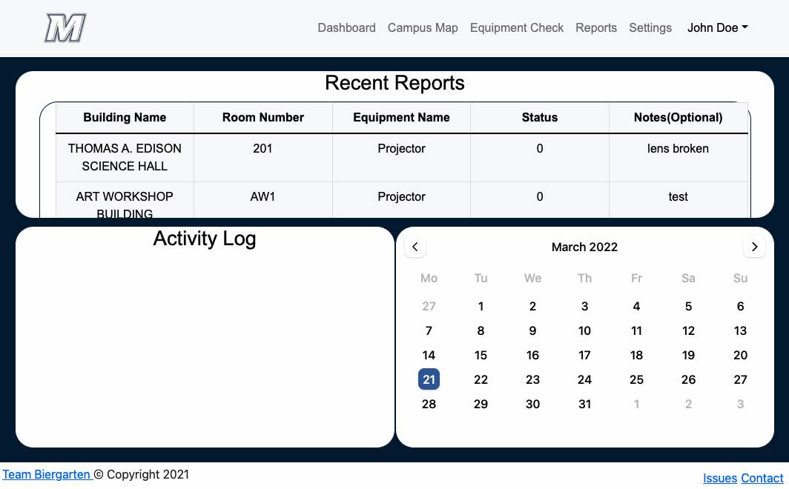

# MICA - Monmouth Inventory Control Application
An inventory web application which allows university employess to monitor univeristy information technology equipment in the classroom

**Live Demo**: https://client.dmrivnmbpg0xd.amplifyapp.com/



Table of Contents
-------

- [Getting Started](#getting-started)
- [Technologies](#technologies)
- [Obtaining API Keys](#obtaining-api-keys)
- [Project Structure](#project-structure)
- [Support](#support)
- [Contributing](#contributing)
- [License](#license)

Getting Started
---------------

The easiest way to get started is to clone the repository:

```bash
# Get the latest snapshot
git clone --depth=1 https://github.com/wrainaud/practicumtest myproject

# Change directory to client
cd myproject/client

# Install node modules 
npm -i

# Create environment variables file to connect to APIs **MAKE SURE TO ADD to .env to .gitignore file**
touch secrets.env

# Create aws-exports.js file for Cognito configuration. Can be sourced directly from AWS: https://aws.amazon.com/cognito/getting-started/
touch aws-exports.js 
```
Obtaining API Keys
-------


- Visit <a href="https://openweathermap.org/api" target="_blank">Open Weather Map</a>
- Sign up for an account <a href="http://home.openweathermap.org/users/sign_up" target="_blank"> Here </a>
- Once you have your API Key, add this line to the `secrets.env` file: `REACT_APP_OWAPIKEY=API KEY GOES HERE`
<hr>

Technologies
-------

- React // https://reactjs.org/
- React-Bootstrap // https://react-bootstrap.github.io/
- Javascript // https://www.javascript.com/
    - Dev Dependencies
        - Axios (Promise-based HTTP Client for Node.js)// https://axios-http.com/docs/intro
        - Babel (JavaScript Compiler) // http://babeljs.io/
        - Webpack (Package bundler) // https://webpack.js.org/
        - env-cmd (Node Environment Variable Executor) // https://www.npmjs.com/package/env-cmd
- Database
    - AWS RDS for MySQL // https://aws.amazon.com/rds/mysql/
- User Authentication
    - AWS Cognito (User Pools / Backend Authentication Service) // https://aws.amazon.com/cognito/
    - AWS Amplify (Authentication Component Library) // https://ui.docs.amplify.aws/
- Hosting 
    - AWS Amplify Hosting // https://aws.amazon.com/amplify/hosting/
- APIs
    - OpenWeatherAPI // https://openweathermap.org/
    - Custom API built by *Megan Allas* // https://gitlab.com/mallas

Project Structure
-------
```
|-- client/
|  |-- amplify/                      // AWS Amplify UI Modules 
|  |-- public/                       // Front end web elements including images and public index.html file
|  |-- src/                          // Source folder
|     |-- components/                // Modular page components
|     |-- images/                    // Static images used within application
|     |-- pages/                     // Individual page builds
|     App.css                        // Additional styles
|     App.js                         // Main React App file
|     aws-exports.js                 // AWS Cognito config file 
|     secrets.env                    // Defines API URLs
|     index.js                       // Main index file
|     UserPool.js                    // AWS Cognito User Pool config file 
| .gitignore                         // Git ignore file - should include aws-exports.js, UserPool.js, secrets.env, and node_modules
| package.json                       // Containing app dependencies 
```

Support
-------

Please [open an issue](https://github.com/wrainaud/practicumtest/issues/new) for support.

Contributing
-------

Please contribute using [Github Flow](https://guides.github.com/introduction/flow/). Create a branch, add commits, and [open a pull request](https://github.com/wrainaud/practicumtest/compare/).

License
-------

The MIT License (MIT)

Copyright (c) 2022 - Team Beirgarten // Monmouth University

Permission is hereby granted, free of charge, to any person obtaining a copy of this software and associated documentation files (the "Software"), to deal in the Software without restriction, including without limitation the rights to use, copy, modify, merge, publish, distribute, sublicense, and/or sell copies of the Software, and to permit persons to whom the Software is furnished to do so, subject to the following conditions:

The above copyright notice and this permission notice shall be included in all copies or substantial portions of the Software.

THE SOFTWARE IS PROVIDED "AS IS", WITHOUT WARRANTY OF ANY KIND, EXPRESS OR IMPLIED, INCLUDING BUT NOT LIMITED TO THE WARRANTIES OF MERCHANTABILITY, FITNESS FOR A PARTICULAR PURPOSE AND NONINFRINGEMENT. IN NO EVENT SHALL THE AUTHORS OR COPYRIGHT HOLDERS BE LIABLE FOR ANY CLAIM, DAMAGES OR OTHER LIABILITY, WHETHER IN AN ACTION OF CONTRACT, TORT OR OTHERWISE, ARISING FROM, OUT OF OR IN CONNECTION WITH THE SOFTWARE OR THE USE OR OTHER DEALINGS IN THE SOFTWARE.  